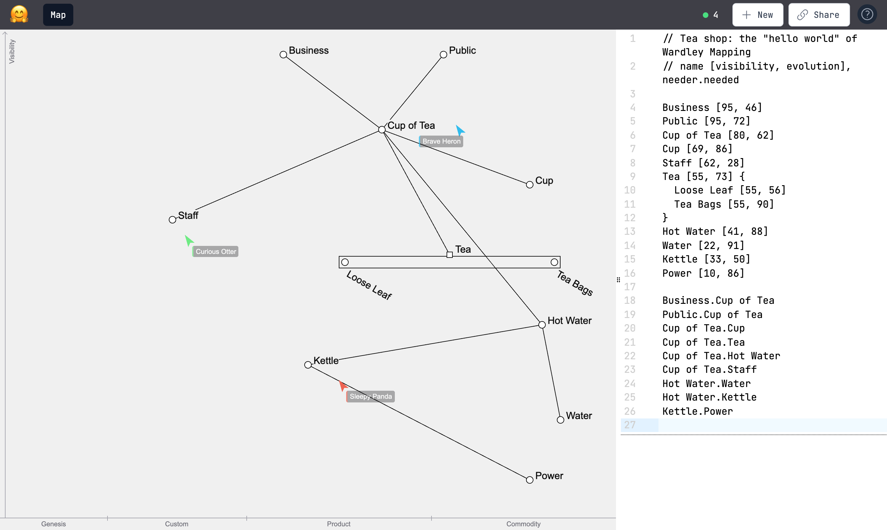

# MapTogether

**Multiplayer Wardley Mapping in your browser.** Open a link, start mapping, and
see your team's edits and cursors live.

[](https://maptogether.io)
[](https://learnwardleymapping.com/)
[](CONTRIBUTING.md#multiplayer)
[](relay/README.md)
[](https://github.com/ayahohner/wmaps/actions/workflows/deploy-relay.yml)



<sub>Three people on the same map, with a pipeline showing loose-leaf tea and tea
bags at different stages of evolution. Everyone sees the others' cursors, and
every edit, on the canvas and in the code, shows up for everyone at once.</sub>

## Why MapTogether

A [Wardley Map](https://learnwardleymapping.com/) shows a value chain against how
evolved each part is, from genesis to commodity. Its value comes from the
conversation it starts, so a map should be something a team builds together, not
a picture one person emails around.

- **Multiplayer from the first click.** Every map has its own URL. Share it and
  anyone with the link can edit with you. No accounts, no sign-up.
- **Draw it or write it.** Drag components around the canvas, or edit the plain
  text beside it. Both stay in sync, so you can sketch fast and fine-tune
  precisely.
- **See who's there.** Named, coloured cursors on the canvas and in the editor
  show where everyone is working. Hover the people count to see who's on the map.
- **Saved automatically.** Maps save as you go, with a status light that only
  turns green once the save is confirmed.
- **Speaks Wardley.** The evolution axis is marked Genesis, Custom, Product and
  Commodity; hover a stage to see what it's called for practices, data and
  knowledge. Pipelines show one need met at several stages of evolution.
- **Fast.** Edits go directly between browsers (peer to peer), and the canvas
  is drawn with WebGL.

## Get started

1. Go to **[maptogether.io](https://maptogether.io)**. You land on a new, empty map.
2. Double-click the canvas, type a component name, and press Enter.
3. Click **Share** to copy the link and send it to your team.

| To | Do this |
| --- | --- |
| Add a component | Double-click the canvas, type a name, press Enter |
| Rename a component | Double-click it |
| Link two components | Hold Ctrl/Cmd, click the first, then the second |
| Move components | Drag them |
| Select several | Drag on the empty canvas; hold Shift to add to the selection |
| Delete | Select, then press Delete or Backspace |
| Start a new map | Click **New** |

## Try the sample map

Paste [`examples/tea-shop.twm`](examples/tea-shop.twm) into the editor of a new
map to get the tea shop above, the classic first Wardley Map. A trimmed-down
version looks like this:

```text
Business [95, 46]
Public [95, 72]
Cup of Tea [80, 62]
Tea [55, 73] {
  Loose Leaf [55, 56]
  Tea Bags [55, 90]
}
Kettle [33, 50]
Power [10, 86]

Business.Cup of Tea
Public.Cup of Tea
Cup of Tea.Tea
Cup of Tea.Kettle
Kettle.Power
```

The text syntax is small:

- `name [visibility, evolution]` places a component. Both numbers run from 0 to
  100: visibility from hidden infrastructure (0) up to the user (100), and
  evolution from genesis (0) across to commodity (100).
- `needer.needed` draws a dependency between two components.
- `name [v, e] { ... }` makes a pipeline: put one child component per line
  inside the braces, each at its own evolution. Children sit on the pipeline's
  row, so their visibility is ignored.
- `// comments` are ignored.

## Status

MapTogether is in **alpha**. Expect rough edges, and please
[open an issue](https://github.com/ayahohner/wmaps/issues) when you hit one.

## Contributing

Development setup, architecture, the multiplayer relay, and the code quality gate
are covered in [CONTRIBUTING.md](CONTRIBUTING.md).
